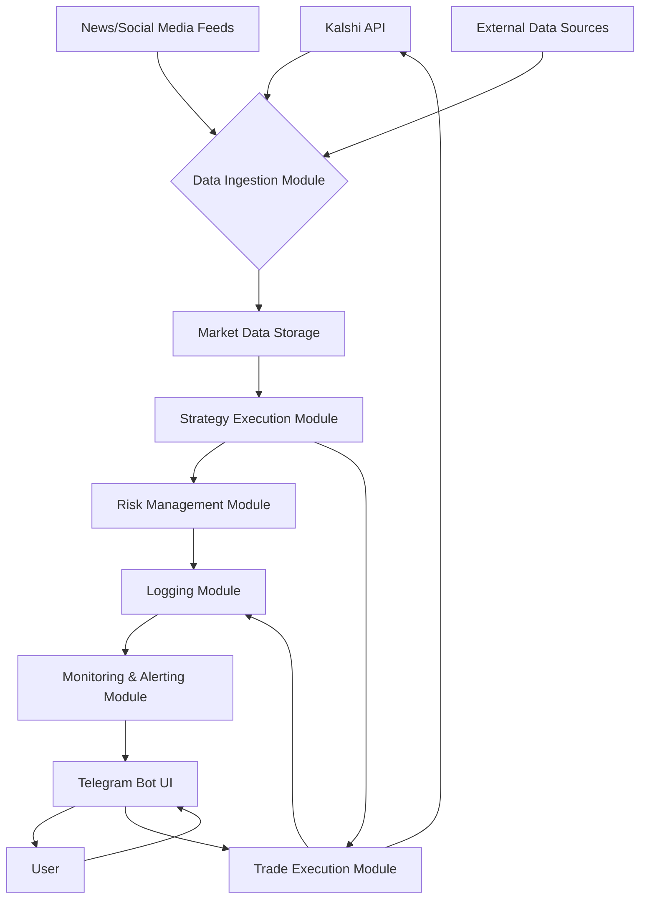

# Advanced Quantitative Strategies and Architecture for Kalshi Trading Bot

## 1. Introduction
This document outlines the design of advanced quantitative strategies and the overall architecture for the Kalshi Trading Bot. The goal is to develop a robust, professional, and high-performing bot capable of making informed trading decisions in event-based markets, specifically on the Kalshi platform. The strategies will leverage various data sources and analytical techniques to identify profitable trading opportunities and manage risk effectively.

## 2. Core Principles of Event-Based Trading
Event-based trading focuses on capitalizing on market inefficiencies that arise before, during, or after specific events. Unlike traditional stock markets, Kalshi deals with event contracts, where the outcome of real-world events determines the payout. This requires a different approach to strategy design, emphasizing:

- **Information Asymmetry:** Exploiting situations where the bot has access to or can process information faster or more effectively than the general market.
- **Predictive Modeling:** Developing models to forecast the outcome of events based on historical data, news sentiment, and other relevant factors.
- **Liquidity and Volume Analysis:** Understanding market depth and trading activity to minimize slippage and optimize entry/exit points.
- **Risk Management:** Implementing robust mechanisms to protect capital against adverse market movements and unexpected event outcomes.

## 3. Proposed Quantitative Strategies

### 3.1. News and Sentiment-Driven Strategy
This strategy will analyze news articles, social media, and other textual data sources to gauge public sentiment and predict event outcomes. Natural Language Processing (NLP) techniques will be employed to extract relevant information and classify sentiment (positive, negative, neutral) related to specific events.

**Data Sources:**
- RSS feeds from reputable news organizations
- Twitter (X) feeds (filtered for relevant keywords and accounts)
- Financial news APIs

**Methodology:**
1. **Data Collection:** Continuously collect and preprocess textual data related to upcoming Kalshi events.
2. **Sentiment Analysis:** Use pre-trained NLP models or develop custom models to analyze the sentiment of collected text.
3. **Event Outcome Prediction:** Correlate sentiment scores with historical event outcomes to build a predictive model. For example, a strong positive sentiment around a political candidate might indicate a higher probability of them winning an election.
4. **Trading Signal Generation:** Generate buy/sell signals based on the predicted probability and the current market price of the event contract. For instance, if the model predicts a high probability of a 'Yes' outcome, and the 'Yes' contract is undervalued, a buy signal is generated.

### 3.2. Statistical Arbitrage on Related Events
Kalshi often lists multiple contracts related to the same underlying event or a series of interconnected events. This strategy will identify and exploit pricing discrepancies between these related contracts.

**Methodology:**
1. **Event Correlation Mapping:** Identify events that are statistically correlated or causally linked. For example, the outcome of a primary election might influence the probabilities of a general election.
2. **Price Relationship Modeling:** Develop statistical models (e.g., cointegration, regression) to understand the historical price relationships between correlated event contracts.
3. **Discrepancy Detection:** Monitor real-time prices of correlated contracts and identify significant deviations from their historical relationships.
4. **Arbitrage Execution:** When a discrepancy is detected, execute a pair trade (e.g., buy one contract and sell another) to profit from the expected convergence of prices.

### 3.3. Volatility and Implied Probability Strategy
This strategy will focus on analyzing the implied probabilities derived from Kalshi contract prices and comparing them with external, objective probabilities (if available) or historical frequencies. It will also consider the volatility of contract prices.

**Methodology:**
1. **Implied Probability Calculation:** Extract implied probabilities from 'Yes' and 'No' contract prices using standard formulas (e.g., `P(Yes) = Yes_Price / (Yes_Price + No_Price)`).
2. **External Probability Comparison:** Where possible, compare implied probabilities with external data sources (e.g., polling data for elections, weather forecasts for weather-related events).
3. **Volatility Analysis:** Analyze historical price volatility of event contracts to identify periods of high or low uncertainty.
4. **Value Betting:** Identify contracts where the implied probability significantly deviates from the bot's estimated true probability, indicating a potential mispricing.

## 4. System Architecture
The proposed architecture will extend the existing bot's structure, incorporating new modules for data ingestion, strategy execution, and enhanced monitoring.

### 4.1. Data Ingestion Module
This module will be responsible for collecting real-time market data from Kalshi, as well as external data sources like news feeds and social media. It will handle data parsing, cleaning, and storage.

### 4.2. Strategy Execution Module
This module will house the implementation of the quantitative strategies described above. It will receive processed data, apply the trading logic, and generate trade signals.

### 4.3. Risk Management Module
This crucial module will implement various risk control measures, including:
- **Position Sizing:** Dynamically adjust the size of trades based on confidence in the prediction and available bankroll.
- **Stop-Loss Mechanisms:** Automatically close positions if losses exceed a predefined threshold.
- **Diversification:** Encourage trading across a variety of uncorrelated events to reduce overall portfolio risk.
- **Exposure Limits:** Set limits on the total capital exposed to any single event or category of events.

### 4.4. Trade Execution Module
This module will be responsible for placing and managing orders on the Kalshi platform based on signals from the Strategy Execution Module and constraints from the Risk Management Module.

### 4.5. Monitoring & Alerting Module
This module will work in conjunction with the Telegram Bot UI to provide real-time monitoring of bot performance, open positions, and system health. It will trigger alerts for critical events (e.g., large losses, API errors, unexpected market movements).

## 5. Technology Stack Enhancements

### 5.1. Python Libraries
- **Pandas:** For efficient data manipulation and analysis.
- **NumPy:** For numerical operations and array processing.
- **Scikit-learn/TensorFlow/PyTorch:** For machine learning models (sentiment analysis, predictive modeling).
- **NLTK/SpaCy:** For advanced Natural Language Processing.
- **Requests:** For API interactions.
- **python-telegram-bot:** For Telegram bot development.

### 5.2. Database (Optional but Recommended)
For more sophisticated data storage and retrieval, a lightweight database like SQLite or PostgreSQL could be integrated to store historical market data, news articles, and trade logs.

## 6. Development Roadmap
1. **Phase 1: Data Ingestion Enhancement:** Implement robust data collection pipelines for news, social media, and external data sources.
2. **Phase 2: Strategy Prototyping:** Develop and backtest initial versions of the News and Sentiment-Driven Strategy and Statistical Arbitrage Strategy.
3. **Phase 3: Risk Management Integration:** Implement core risk management functionalities.
4. **Phase 4: Telegram Bot UI Expansion:** Enhance the Telegram bot to provide more detailed monitoring, interactive controls, and custom alerts.
5. **Phase 5: Performance Optimization and Testing:** Optimize code for performance, conduct extensive backtesting, and deploy in a simulated environment for real-time testing.

## 7. Conclusion
This design document provides a comprehensive plan for transforming the existing Kalshi Trading Bot into a sophisticated, quant-grade system. By implementing advanced strategies, a robust architecture, and enhanced monitoring capabilities, the bot will be well-equipped to navigate the complexities of event-based markets and generate consistent returns while effectively managing risk.

## References
[1] Investopedia. (n.d.). *Event-Driven Investing Strategies and Examples*. Retrieved from https://www.investopedia.com/terms/e/eventdriven.asp
[2] Quantified Strategies. (n.d.). *Event-Driven Trading Strategies (Event-Based Trading - Backtest ...)*. Retrieved from https://www.quantifiedstrategies.com/event-driven-trading-strategies/
[3] QuantInsti. (n.d.). *Event Driven Trading Strategies Course - Quantra by QuantInsti*. Retrieved from https://quantra.quantinsti.com/course/event-driven-trading-strategies
[4] IEEE Xplore. (2021). *The Driving Engine of Quantitative Trading Strategy Based on Event ...*. Retrieved from https://ieeexplore.ieee.org/document/9546358/
[5] LinkedIn. (2025, February 27). *Event-driven Trading Strategies with Practical Example on Python*. Retrieved from https://www.linkedin.com/pulse/event-driven-trading-strategies-practical-example-python-khanlarov-wlm1e
[6] Number Analytics. (n.d.). *Event-Driven Trading Strategies*. Retrieved from https://www.numberanalytics.com/blog/advanced-event-driven-trading-strategies
[7] Street Of Walls. (n.d.). *Quantitative Trading Strategies*. Retrieved from https://www.streetofwalls.com/finance-training-courses/quantitative-hedge-fund-training/quant-trading-strategies/
[8] The Hedge Fund Journal. (n.d.). *Event-Driven Strategies*. Retrieved from https://thehedgefundjournal.com/event-driven-strategies/
[9] QuantStart. (n.d.). *Event-Driven Backtesting with Python - Part I*. Retrieved from https://www.quantstart.com/articles/Event-Driven-Backtesting-with-Python-Part-I/
[10] Zen Trading Strategies. (n.d.). *Event-Driven Trading: Strategies for Profiting from News and ...*. Retrieved from https://www.zentradingstrategies.com/event-driven-trading-strategies-for-profiting-from-news-and-corporate-events/
[11] Reddit. (2022, September 23). *Kalshi Trading Tips*. Retrieved from https://www.reddit.com/r/Kalshi/comments/xm81k7/kalshi_trading_tips/
[12] YouTube. (2025, February 28). *Easiest Way to make Money Fast (US Traders: Kalshi)?*. Retrieved from https://www.youtube.com/watch?v=gIq29rqEFak
[13] Props.com. (2025, May 24). *Kalshi Sports Trading Strategy - 2025 Prediction Markets Guide*. Retrieved from https://props.com/kalshi-super-bowl-trading-guide-big-game-strategy/
[14] Kalshi. (n.d.). *Kalshi - Prediction Market for Trading the Future*. Retrieved from https://kalshi.com/
[15] Hacker News. (n.d.). *Making Markets on Kalshi*. Retrieved from https://news.ycombinator.com/item?id=43073377
[16] Kalshi. (n.d.). *Kalshi Learn*. Retrieved from https://kalshi.com/blog/article/iron-condors
[17] GitHub. (n.d.). *quantgalore/kalshi-trading*. Retrieved from https://github.com/quantgalore/kalshi-trading
[18] YouTube. (2024, January 17). *The Best Trading Strategy That Nobody Knows About*. Retrieved from https://www.youtube.com/watch?v=XbO5sjQBLVc
[19] Kalshi Help Center. (2025, March 4). *Buying Yes vs Selling No*. Retrieved from https://help.kalshi.com/trading/buying-yes-vs-selling-no
[20] GitHub. (n.d.). *nikhilnd/kalshi-market-making*. Retrieved from https://github.com/nikhilnd/kalshi-market-making
[21] Stanford University. (2014). *Event-based stock market prediction*. Retrieved from https://cs229.stanford.edu/proj2014/Hadi%20Pouransari,%20Hamid%20Chalabi,%20Event-based%20stock%20market%20prediction.pdf
[22] IEEE Xplore. (n.d.). *Stock Prediction Using Event-Based Sentiment Analysis*. Retrieved from https://ieeexplore.ieee.org/document/6690034/
[23] GitHub. (n.d.). *vedic-partap/Event-Driven-Stock-Prediction-using-Deep-Learning*. Retrieved from https://github.com/vedic-partap/Event-Driven-Stock-Prediction-using-Deep-Learning
[24] Reddit. (2025, January 24). *Best approach for modelling time-series market data with event ...*. Retrieved from https://www.reddit.com/r/learnmachinelearning/comments/1i8pb65/best_approach_for_modelling_timeseries_market/
[25] HIT. (n.d.). *Deep Learning for Event-Driven Stock Prediction*. Retrieved from https://ir.hit.edu.cn/_upload/article/files/05/e8/ba38d4fc4befa1522fd7bbef42ff/599a593e-d2b5-4997-9e57-fb741c3f40d8.pdf
[26] GitHub. (n.d.). *Macro-event-based-stock-market-prediction*. Retrieved from https://github.com/rjagait/Macro-event-based-stock-market-prediction
[27] IdeaUsher. (n.d.). *Event Prediction Marketplace Development - Cost and Features*. Retrieved from https://ideausher.com/blog/event-prediction-marketplace-development-cost-and-features/
[28] ResearchGate. (n.d.). *A Multimodal Event-driven LSTM Model for Stock Prediction Using Online News*. Retrieved from https://www.researchgate.net/publication/338783254_A_Multimodal_Event-driven_LSTM_Model_for_Stock_Prediction_Using_Online_News
[29] GRENZE Scientific Society. (n.d.). *Event Driven Stock Prediction*. Retrieved from https://thegrenze.com/pages/servej.php?fn=147.pdf&name=Event%20Driven%20Stock%20Prediction&id=2521&association=GRENZE&journal=GIJET&year=2024&volume=10&issue=1
[30] Medium. (2023, January 26). *Down the Rabbit Hole of Event Prediction: A Guide to Time-Related ...*. Retrieved from https://medium.com/geekculture/down-the-rabbit-hole-of-event-prediction-a-guide-to-time-related-event-analysis-and-beyond-7529591adada

